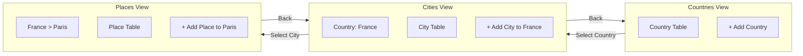

# Admin CRUD Pages

## Architecture

Create a hierarchical admin interface where navigation flows: **Countries -> Cities -> Places**. When a country is selected, cities for that country are shown. When a city is selected, places for that city are shown. Creating new records automatically uses the selected parent context.



## UI Flow

1. **Countries View** (default): Shows all countries in a table with edit/delete actions. "Add Country" button opens form dialog.
2. **Cities View** (country selected): Shows breadcrumb with selected country name. Table displays cities filtered by the selected country. "Add City" button pre-fills the countryId automatically.
3. **Places View** (city selected): Shows breadcrumb with country and city. Table displays places filtered by the selected city. "Add Place" button pre-fills the cityId automatically.

## Key Files

### Backend Changes

- Add delete mutations to [`convex/functions/country.ts`](convex/functions/country.ts) and [`convex/functions/city.ts`](convex/functions/city.ts)

### UI Components (New)

- `src/components/ui/dialog.tsx` - Dialog/modal for forms
- `src/components/ui/table.tsx` - Styled table components

### Admin Components (New)

- `src/components/admin/AdminBreadcrumb.tsx` - Navigation breadcrumb showing hierarchy
- `src/components/admin/CountryTable.tsx` - Table with row click to select country
- `src/components/admin/CountryForm.tsx` - Create/edit form
- `src/components/admin/CityTable.tsx` - Table filtered by selected country
- `src/components/admin/CityForm.tsx` - Form with countryId auto-filled from selection
- `src/components/admin/PlaceTable.tsx` - Table filtered by selected city
- `src/components/admin/PlaceForm.tsx` - Form with cityId auto-filled from selection

### Routes (File-Based with Dynamic Path Params)

Using [TanStack Router's dynamic path params](https://tanstack.com/router/latest/docs/framework/react/guide/path-params), the hierarchy is expressed in the URL path with descriptive segments:

```
src/routes/
├── admin.tsx                                         # Layout with breadcrumb
├── admin/
│   ├── index.tsx                                     # /admin - Countries list
│   ├── country.$countryId.tsx                        # Layout for country context
│   ├── country.$countryId/
│   │   ├── index.tsx                                 # /admin/country/$countryId - Cities list
│   │   ├── city.$cityId.tsx                          # Layout for city context  
│   │   └── city.$cityId/
│   │       └── index.tsx                             # /admin/country/$countryId/city/$cityId - Places list
```

## URL-Based State with Path Params

**URL Examples:**

- `/admin` - Shows countries list
- `/admin/country/k57abc123` - Shows cities for country with ID `k57abc123`
- `/admin/country/k57abc123/city/k57def456` - Shows places for city with ID `k57def456`
```typescript
// src/routes/admin/country.$countryId/index.tsx - Cities view
import { createFileRoute } from '@tanstack/react-router'

export const Route = createFileRoute('/admin/country/$countryId/')({
  component: CitiesPage,
})

function CitiesPage() {
  // Path param is type-safe and available via useParams
  const { countryId } = Route.useParams()
  
  // countryId is automatically available for filtering and forms
  return <CityTable countryId={countryId as Id<"country">} />
}
```
```typescript
// src/routes/admin/country.$countryId/city.$cityId/index.tsx - Places view
import { createFileRoute } from '@tanstack/react-router'

export const Route = createFileRoute('/admin/country/$countryId/city/$cityId/')({
  component: PlacesPage,
})

function PlacesPage() {
  const { countryId, cityId } = Route.useParams()
  
  // cityId is automatically available for filtering and forms
  return <PlaceTable cityId={cityId as Id<"city">} />
}
```
```typescript
// Navigation examples using Link component
<Link to="/admin/country/$countryId" params={{ countryId: country._id }}>
  {country.name}
</Link>

<Link 
  to="/admin/country/$countryId/city/$cityId" 
  params={{ countryId, cityId: city._id }}
>
  {city.name}
</Link>
```


**Benefits:**

- Self-documenting URLs: `/admin/country/abc/city/def` clearly shows the hierarchy
- Browser back/forward navigation works naturally
- Type-safe path params with `Route.useParams()`
- Shareable/bookmarkable URLs
- Params available in loaders for data prefetching