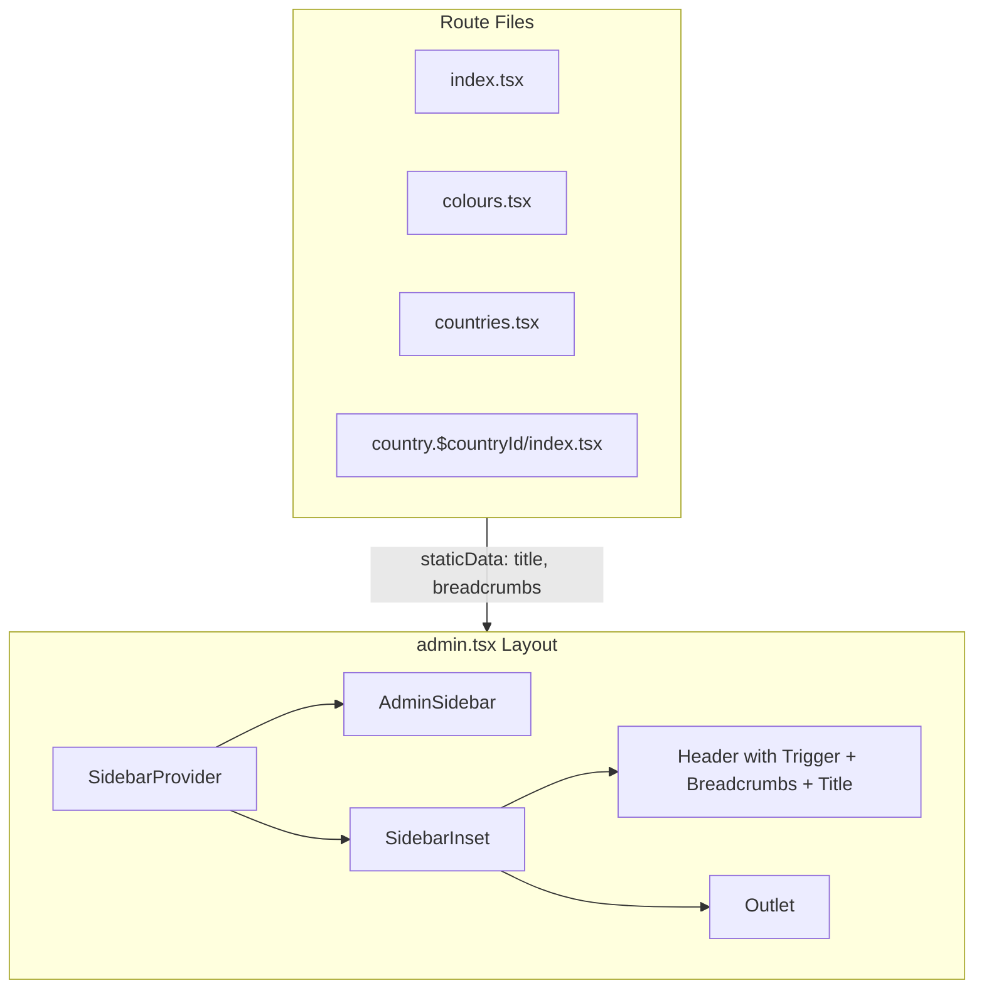

# Admin Layout and Sidebar Refactor

## Overview

Update the admin section to use Shadcn's sidebar component system (`SidebarProvider`, `Sidebar`, `SidebarInset`, etc.) with a standardized header that includes the sidebar trigger, breadcrumbs, and page title - all managed from the layout.

## Architecture




## Files to Modify

### 1. Update AdminSidebar ([`src/components/admin/AdminSidebar.tsx`](src/components/admin/AdminSidebar.tsx))

Refactor to use Shadcn sidebar primitives:

- Use `Sidebar` with `variant="floating"` and `collapsible="icon"`
- Use `SidebarHeader` with app branding
- Use `SidebarContent` > `SidebarGroup` > `SidebarMenu` structure
- Use `SidebarMenuSub` and `SidebarMenuSubItem` for nested country/city tree
- Replace custom collapsible logic with built-in sidebar collapse via `useSidebar`
- Keep the navigation structure: Dashboard, Colours, Countries (with expandable cities)

Key components to use:

```tsx
<Sidebar variant="floating" collapsible="icon">
  <SidebarHeader>...</SidebarHeader>
  <SidebarContent>
    <SidebarGroup>
      <SidebarMenu>
        <SidebarMenuItem>
          <SidebarMenuButton />
          <SidebarMenuSub>
            <SidebarMenuSubItem />
          </SidebarMenuSub>
        </SidebarMenuItem>
      </SidebarMenu>
    </SidebarGroup>
  </SidebarContent>
</Sidebar>
```


### 2. Update Admin Layout ([`src/routes/_authenticated/admin.tsx`](src/routes/_authenticated/admin.tsx))

Transform to use the new sidebar system with a standardized header:

- Wrap everything in `SidebarProvider`
- Use `SidebarInset` for main content area
- Add header with `SidebarTrigger`, `Separator`, `Breadcrumb` components, and page title
- Read breadcrumb/title data from child routes via `useMatches()` and route `staticData`

Structure:

```tsx
<SidebarProvider>
  <AdminSidebar />
  <SidebarInset>
    <header>
      <SidebarTrigger />
      <Separator orientation="vertical" />
      <Breadcrumb>...</Breadcrumb>
      <h1>{title}</h1>
    </header>
    <main>
      <Outlet />
    </main>
  </SidebarInset>
</SidebarProvider>
```


### 3. Update Admin Pages (remove individual breadcrumb/header handling)

Each page needs to:

- Add `staticData` to route definition with `title` and `breadcrumbs`
- Remove `AdminBreadcrumb` component usage
- Remove duplicate header/title sections

**Pages to update:**

- [`src/routes/_authenticated/admin/index.tsx`](src/routes/_authenticated/admin/index.tsx)
- [`src/routes/_authenticated/admin/colours.tsx`](src/routes/_authenticated/admin/colours.tsx)
- [`src/routes/_authenticated/admin/countries.tsx`](src/routes/_authenticated/admin/countries.tsx)
- [`src/routes/_authenticated/admin/country.$countryId/index.tsx`](src/routes/_authenticated/admin/country.$countryId/index.tsx)
- [`src/routes/_authenticated/admin/country.$countryId/city.$cityId/index.tsx`](src/routes/_authenticated/admin/country.$countryId/city.$cityId/index.tsx)
- [`src/routes/_authenticated/admin/country.$countryId/city.$cityId/place.$placeId/index.tsx`](src/routes/_authenticated/admin/country.$countryId/city.$cityId/place.$placeId/index.tsx)
- Any other admin route files

### 4. Define Types for Route Static Data

Create a type for the admin page metadata:

```tsx
interface AdminPageData {
  title: string
  breadcrumbs: Array<{ label: string; to?: string; params?: Record<string, string> }>
}
```


## Implementation Notes

- For dynamic breadcrumbs (e.g., country name), routes with params will need to use `loader` or `beforeLoad` to fetch the entity name and pass it via context, since `staticData` is static
- The `useMatches()` hook from TanStack Router will be used in the layout to read the current route's metadata