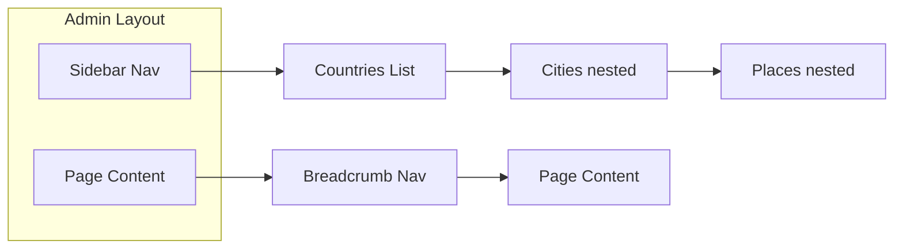

# Admin Sidebar Navigation & Breadcrumb Standardization

## Overview

This plan adds a persistent sidebar navigation to the admin section, enabling fast jumps between countries, cities, and places. It also standardizes breadcrumb navigation across all admin pages.

## Proposed Navigation Structure

## Key Changes

### 1. Create Admin Sidebar Component

Create a new `AdminSidebar.tsx` component in [`src/components/admin/`](src/components/admin/) that:

- Fetches all countries and their cities from Convex
- Displays a collapsible tree structure: Countries > Cities
- Highlights the currently active country/city based on route params
- Supports keyboard navigation and collapsible sections
- Is responsive (collapsible on mobile)

### 2. Update Admin Layout Route

Modify [`src/routes/_authenticated/admin.tsx`](src/routes/_authenticated/admin.tsx) to:

- Include the sidebar alongside the `<Outlet />`
- Use a flex layout with sidebar on the left
- Make the sidebar collapsible with a toggle button

### 3. Standardize Breadcrumb on Colours Page

Update [`src/routes/_authenticated/admin/colours.tsx`](src/routes/_authenticated/admin/colours.tsx) to:

- Import and use `AdminBreadcrumb` component
- Add consistent page header styling matching other admin pages

### 4. Update Breadcrumb Links

Fix breadcrumb "Countries" link to point to `/admin/countries` instead of `/admin` where appropriate for consistency.

## Implementation Details

### Sidebar Features

- Expandable country nodes showing cities underneath
- Active state highlighting for current country/city/place
- Scrollable list with sticky header
- Toggle button to collapse/expand sidebar
- Remembers collapsed state in localStorage

### File Changes

| File | Action |

|------|--------|

| `src/components/admin/AdminSidebar.tsx` | Create new sidebar component |

| `src/routes/_authenticated/admin.tsx` | Add sidebar to layout |

| `src/routes/_authenticated/admin/colours.tsx` | Add breadcrumb |