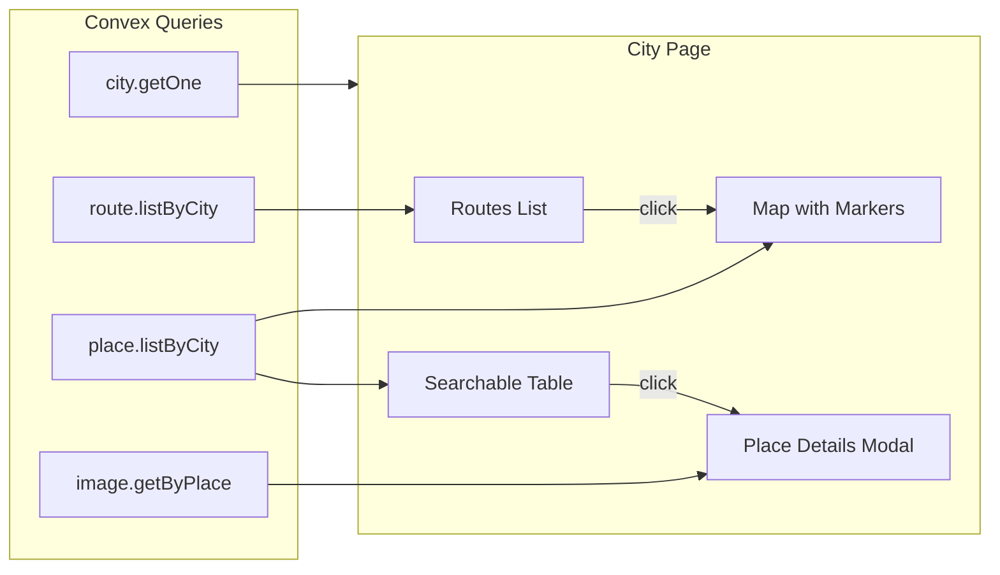

# City Public Page Implementation

## Overview

Create a user-facing city page that displays:

- An interactive map with place markers (filterable by category with clean display names)
- A searchable table of places with click-to-view details
- A list of available routes with click-to-show on map

## Key Files

- **New route**: `src/routes/country.$countryId.city.$cityId.tsx` - Main city page
- **New utility**: `src/lib/category-utils.ts` - Category formatting helper
- **Existing components to leverage**:
- [`src/components/ui/map.tsx`](src/components/ui/map.tsx) - Map with `MapRoute` for route rendering
- [`src/components/ui/dialog.tsx`](src/components/ui/dialog.tsx) - Place details modal
- [`src/components/ui/table.tsx`](src/components/ui/table.tsx), [`src/components/ui/input.tsx`](src/components/ui/input.tsx), [`src/components/ui/badge.tsx`](src/components/ui/badge.tsx)

## Data Flow




## Implementation Details

### 1. Category Utility (`src/lib/category-utils.ts`)

Create a mapping function to convert raw category values to user-friendly display names:

```typescript
const categoryLabels: Record<string, string> = {
  "gallery+museum": "Gallery & Museum",
  "park": "Park",
  "restaurant": "Restaurant",
  "cafe+bakery+snacks": "Cafe, Bakery & Snacks",
  "bar+pub+club": "Bar, Pub & Club",
  "rooftop_bar": "Rooftop Bar",
  "hotel": "Hotel",
  "theatre+concert_hall+venue": "Theatre, Concert Hall & Venue",
  "landmark+church+view": "Landmark, Church & View",
  "other": "Other",
};
```


### 2. Route File Structure

The page will have three main sections with state management for:

- `categoryFilter: string | null` - Selected category filter
- `searchQuery: string` - Places table search
- `selectedPlace: Place | null` - Place for details modal
- `selectedRouteId: Id<"route"> | null` - Route to display on map

### 3. Map Section

- Render markers for all places with coordinates (filtered by category when active)
- When a place marker is clicked, open the place details dialog
- When a route is selected, use `MapRoute` component to render the route line connecting place coordinates

### 4. Places Table

- Searchable by name
- Display columns: Name, Category (cleaned), Rating
- Click row to open place details dialog

### 5. Place Details Dialog

- Display place name, description, notes, rating
- Fetch and display images using `image.getByPlace` query
- Show category with cleaned display name

### 6. Routes List

- List all routes for the city with name and description
- Show number of stops
- Click to select route and highlight on map (toggle behavior)