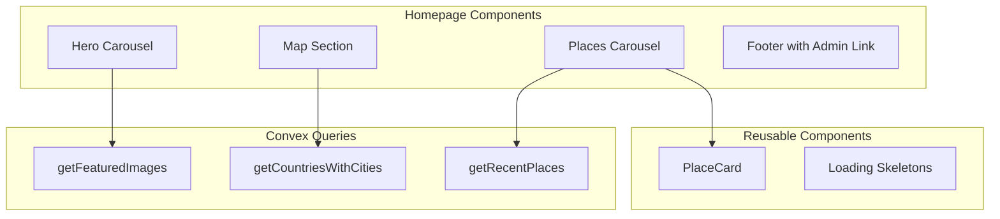

# Public Homepage Redesign

## Overview

Replace the current demo content in [`src/routes/index.tsx`](src/routes/index.tsx) with a rich landing page featuring:

- **Top**: Hero carousel of up to 10 featured images linking to their locations
- **Middle**: Interactive map with countries sidebar for filtering cities
- **Bottom**: Carousel of 20 recent place cards with links
- **Footer**: Admin portal navigation button

## Architecture




## Changes Required

### 1. Schema Update - Add `featured` field to images

Update [`convex/schema.ts`](convex/schema.ts) to add an optional `featured` boolean field to the `image` table.

```ts
image: defineTable({
  // ... existing fields
  featured: v.optional(v.boolean()),
}).index("byFeatured", ["featured"])
```


### 2. New Convex Queries

Create a new file [`convex/functions/homepage.ts`](convex/functions/homepage.ts) with three queries:

- **`getFeaturedImages`**: Returns up to 10 images where `featured === true`, with URLs and resolved location data (city/place name, countryId, cityId)
- **`getCountriesWithCities`**: Returns all countries with their associated cities (for map navigation)
- **`getRecentPlaces`**: Returns the 20 most recent places with city and country names resolved, including iconImage URLs

### 3. Reusable Components

#### PlaceCard Component (`src/components/PlaceCard.tsx`)

A reusable card component for displaying place information:

```tsx
type PlaceCardProps = {
  place: {
    _id: Id<"place">;
    name: string;
    category: Category;
    rating?: number;
    iconImage?: string;
    cityName: string;
    countryId: Id<"country">;
    cityId: Id<"city">;
  };
  className?: string;
};
```

Features:

- Place image with fallback gradient based on category
- Place name and city subtitle
- Category badge
- Star rating display (if available)
- Click navigates to city page with place context

#### Image URL Utility (`src/lib/image-utils.ts`)

Add a helper function to build R2 image URLs consistently:

```ts
export function getImageUrl(key: string): string {
  // Build URL from R2 bucket configuration
}
```


### 4. Homepage Layout Structure

Rewrite [`src/routes/index.tsx`](src/routes/index.tsx):

```javascript
<Page className="min-h-screen flex flex-col">
  <Header /> (minimal: logo/title only, no auth buttons)
  
  <main className="flex-1">
    <HeroSection>
      <Carousel> 
        10 featured images with:
                - Full-width background image
                - Gradient overlay for text readability
                - Location name + "Explore" link button
      </Carousel>
    </HeroSection>
    
    <MapSection>
      <div className="grid grid-cols-1 lg:grid-cols-4">
        <CountrySidebar> 
                    - List of countries with city counts
                    - "All" option to show all cities
                    - Selected country highlighted
        </CountrySidebar>
        <MapContainer className="lg:col-span-3">
          <Map> 
                        - City markers filtered by selected country
                        - Click marker to navigate to city page
                        - Tooltip shows city name
          </Map>
        </MapContainer>
      </div>
    </MapSection>
    
    <PlacesSection>
      <SectionHeader>Recent Places</SectionHeader>
      <Carousel opts={{ align: "start" }}>
        20 PlaceCard components
      </Carousel>
    </PlacesSection>
  </main>
  
  <Footer>
    <Link to="/admin">
      <Button variant="outline">
        Admin Portal
      </Button>
    </Link>
  </Footer>
</Page>
```


### 5. Loading States

Each section should have a skeleton loader:

- **Hero**: Single skeleton with shimmer effect (full carousel height)
- **Map Section**: Skeleton sidebar + gray map placeholder
- **Places**: Row of skeleton cards matching PlaceCard dimensions

Use React Suspense boundaries around each section for clean loading states.

### 6. Styling Approach

- Use existing UI components: `Carousel`, `Card`, `Map`, `Badge`, `Button`
- Dark/light theme compatible using CSS variables
- Responsive layout:
        - Mobile: Countries as horizontal scroll above map
        - Desktop: Countries as vertical sidebar (25% width)
- Hero carousel: 70vh height with image cover
- Smooth hover effects and transitions on cards

## Files to Modify/Create

| File | Action ||------|--------|| `convex/schema.ts` | Add `featured` field + `byFeatured` index to image table || `convex/functions/homepage.ts` | Create with 3 new queries || `src/components/PlaceCard.tsx` | New reusable place card component || `src/lib/image-utils.ts` | Add getImageUrl helper (if needed) || `src/routes/index.tsx` | Complete rewrite with new layout |

## Navigation Flow