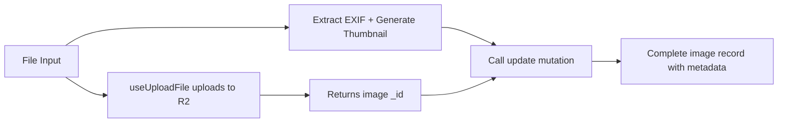

# Place Image Upload Form Implementation

## Overview

Add a dedicated image upload form for places that leverages the existing Convex R2 integration:

1. Upload full-resolution images to Cloudflare R2 using `useUploadFile`
2. The hook returns the image `_id` (existing `onUpload` creates the record)
3. Extract GPS coordinates and capture datetime from EXIF metadata (client-side)
4. Generate a low-res AVIF thumbnail stored as base64 (client-side)
5. Update the image record with metadata using the existing `update` mutation

## Architecture

## Existing Code to Leverage

- [convex/functions/image.ts](convex/functions/image.ts): `useUploadFile` hook + `onUpload` callback already creates image record
- [convex/functions/image.ts](convex/functions/image.ts) lines 110-126: `update` mutation patches image record  
- [src/lib/image-utils.ts](src/lib/image-utils.ts): decode, encode, resize, blobToBase64 utilities

## Implementation Steps

### 1. Install EXIF Library

Install `exifreader` package to parse EXIF metadata from images.

### 2. Add EXIF Extraction Utility  

Extend `src/lib/image-utils.ts` with a function to extract:

- GPS coordinates (lat/lng) from EXIF GPSLatitude/GPSLongitude
- DateTime from EXIF DateTimeOriginal or DateTime tags

### 3. Create PlaceImageUploadForm Component

Build a React component that:

- Uses `useUploadFile` hook from `@convex-dev/r2/react`
- On file selection: extracts EXIF data and generates low-res AVIF thumbnail using existing utilities
- Uploads to R2 and receives the image `_id` from the hook