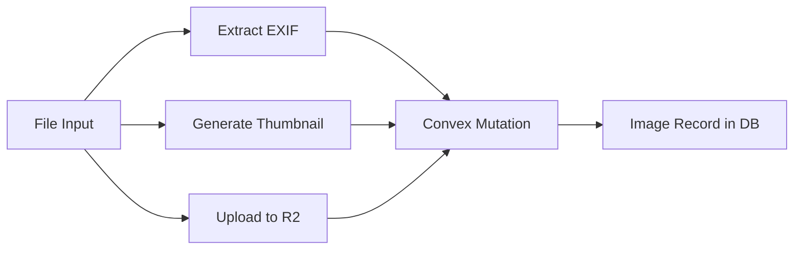

# Place Image Upload Form Implementation

## Overview

Add a dedicated image upload form for places that leverages the existing Convex R2 integration to:

1. Upload full-resolution images to Cloudflare R2
2. Extract GPS coordinates and capture datetime from EXIF metadata
3. Generate a low-res AVIF thumbnail stored as base64 in Convex
4. Associate the image with a specific place

## Architecture

## Key Files

- [src/lib/image-utils.ts](src/lib/image-utils.ts) - Extend with EXIF extraction
- [convex/functions/image.ts](convex/functions/image.ts) - Add mutation for creating image with metadata
- New: `src/components/admin/PlaceImageUploadForm.tsx` - The upload form component

## Implementation Steps

### 1. Install EXIF Library

Install `exifreader` package to parse EXIF metadata from images.

### 2. Add EXIF Extraction Utility

Extend `src/lib/image-utils.ts` with a function to extract:

- GPS coordinates (lat/lng)
- DateTime from EXIF DateTimeOriginal or DateTime tags

### 3. Create Convex Mutation

Add a mutation in `convex/functions/image.ts` to create an image record with:

- R2 bucket/key
- Extracted lat/lng and datetime
- Base64 iconImage thumbnail
- Place association

### 4. Create PlaceImageUploadForm Component

Build a React component that: