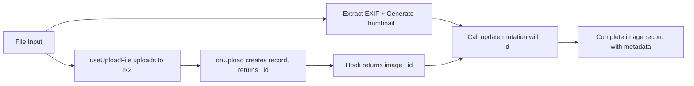

# Place Image Upload Form Implementation

## Overview

Add a dedicated image upload form for places that leverages the existing Convex R2 integration:

1. Upload full-resolution images to Cloudflare R2 
2. `onUpload` creates image record and returns the `_id`
3. Extract GPS coordinates and capture datetime from EXIF metadata (client-side)
4. Generate a low-res AVIF thumbnail stored as base64 (client-side)
5. Update the image record with metadata using the `update` mutation

## Architecture

## Existing Code to Leverage

- [convex/functions/image.ts](convex/functions/image.ts) lines 61-75: `onUpload` callback - modify to return `_id`
- [convex/functions/image.ts](convex/functions/image.ts) lines 110-126: `update` mutation patches image record
- [src/lib/image-utils.ts](src/lib/image-utils.ts): decode, encode, resize, blobToBase64 utilities

## Implementation Steps

### 1. Install EXIF Library

Install `exifreader` package to parse EXIF metadata from images.

### 2. Add EXIF Extraction Utility

Extend `src/lib/image-utils.ts` with a function to extract:

- GPS coordinates (lat/lng) from EXIF GPSLatitude/GPSLongitude
- DateTime from EXIF DateTimeOriginal or DateTime tags

### 3. Modify onUpload to Return Image ID

Update the `onUpload` callback in `convex/functions/image.ts` to return the `_id` from `ctx.db.insert()` so the client can use it for the update.

### 4. Create PlaceImageUploadForm Component

Build a React component that:

- Uses `useUploadFile` hook from `@convex-dev/r2/react` 