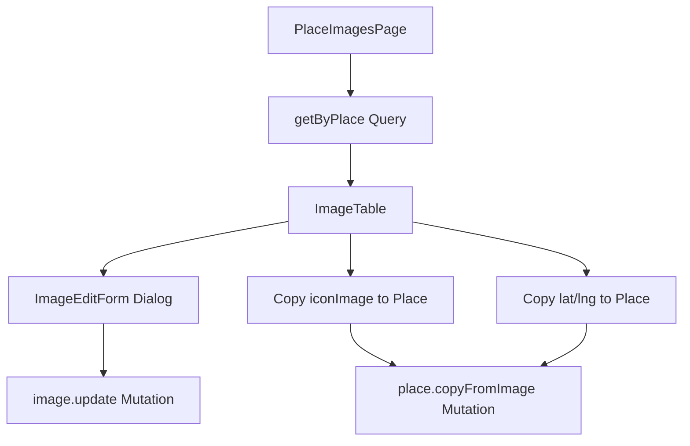

# Place Images Admin Page

## Overview

Add a new page in the admin panel at `/admin/country/$countryId/city/$cityId/place/$placeId/` to view and manage images associated with a place, including the ability to edit image details and copy the image's `iconImage` and `lat/lng` coordinates to the parent place.

## Files to Create

### 1. Backend - Convex Functions

**[convex/functions/image.ts](convex/functions/image.ts)** - Add new query and mutation:

- `getByPlace` query - Fetch all images associated with a specific place using the existing `byImageType_byLocationId` index
- Add logic to also return the image URLs using `r2.getUrl()`

**[convex/functions/place.ts](convex/functions/place.ts)** - Add new mutation:

- `copyFromImage` mutation - Update a place's `iconImage` and/or `lat/lng` from a specific image

### 2. Frontend - New Route Files

**`src/routes/admin/country.$countryId/city.$cityId/place.$placeId/index.tsx`** - The images list page for a place, following the existing pattern**`src/routes/admin/country.$countryId/city.$cityId/place.$placeId.tsx`** - Layout wrapper for the place route

### 3. Frontend - New Components

**`src/components/admin/ImageTable.tsx`** - Table component to display images for a place with:

- Image thumbnail display
- Description, dateTime, lat/lng display
- Edit, Delete actions
- "Set as Place Icon" and "Copy Location to Place" action buttons

**`src/components/admin/ImageEditForm.tsx`** - Form to edit existing image details:

- Description field
- Lat/lng fields (editable)
- DateTime field (editable)

### 4. Update Component Index

**[src/components/admin/index.ts](src/components/admin/index.ts)** - Export new components

## Data Flow

