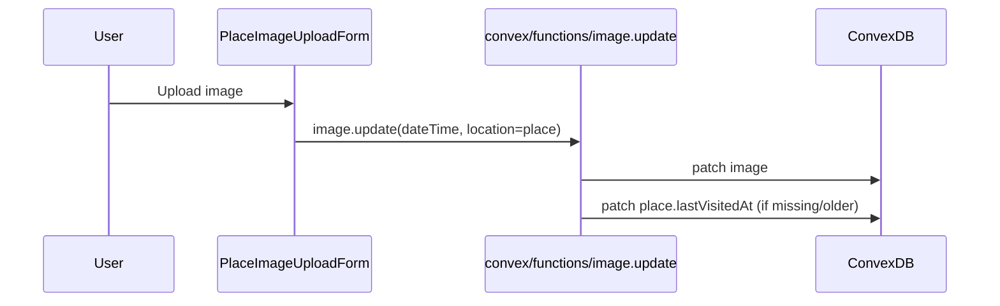

# Add Place.lastVisitedAt + set from EXIF

## Goal

- Add an optional **`lastVisitedAt`** (ms since epoch) to `place`.
- When an image is uploaded for a place and EXIF capture time is extracted into `image.dateTime`, automatically set `place.lastVisitedAt` from that value.

## Key decisions (confirmed)

- **Storage/display**: full datetime timestamp (ms), matching `image.dateTime`.
- **Set behavior**: automatic on upload.

## Implementation

- **Schema**: Add `lastVisitedAt: v.optional(v.number())` to the `place` table in [`/Users/jackwynne/dev/travel/convex/schema.ts`](/Users/jackwynne/dev/travel/convex/schema.ts).
- **Server-side auto-update**: In [`/Users/jackwynne/dev/travel/convex/functions/image.ts`](/Users/jackwynne/dev/travel/convex/functions/image.ts) inside the `update` mutation, after patching the image:
- If `updates.dateTime` is a number and `updates.location?.imageType === "place"`, load that place and patch `lastVisitedAt`.
- Default rule: **only move forward** (set if missing or older than the image timestamp) to avoid an older photo overwriting a newer visit.
- **Admin UI**: Expose manual editing in [`/Users/jackwynne/dev/travel/src/components/admin/PlaceForm.tsx`](/Users/jackwynne/dev/travel/src/components/admin/PlaceForm.tsx):
- Add a `datetime-local` input (stored in the form as a string), converted to `lastVisitedAt` milliseconds on submit.

## Data flow

## Files to change

- [`/Users/jackwynne/dev/travel/convex/schema.ts`](/Users/jackwynne/dev/travel/convex/schema.ts)
- [`/Users/jackwynne/dev/travel/convex/functions/image.ts`](/Users/jackwynne/dev/travel/convex/functions/image.ts)
- [`/Users/jackwynne/dev/travel/src/components/admin/PlaceForm.tsx`](/Users/jackwynne/dev/travel/src/components/admin/PlaceForm.tsx)

## Todos

- `schema-place-lastVisitedAt`: Add `lastVisitedAt` to `place` schema
- `image-update-autoset-lastVisitedAt`: Auto-set `place.lastVisitedAt` from `image.dateTime` when location is a place